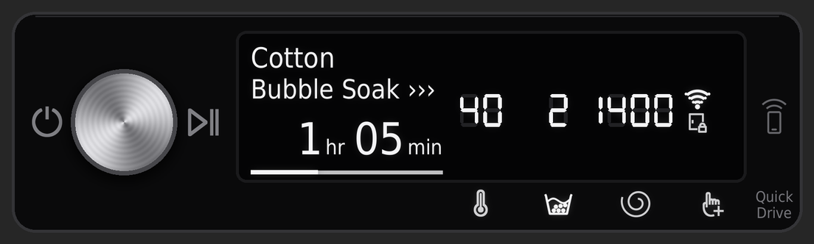
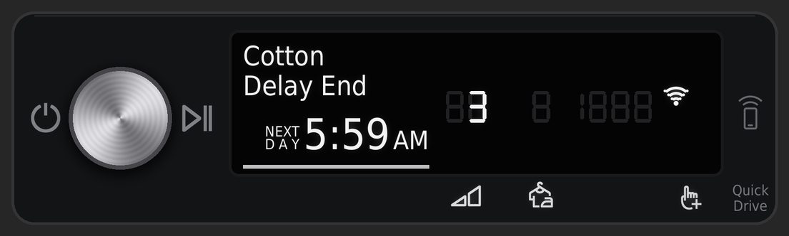
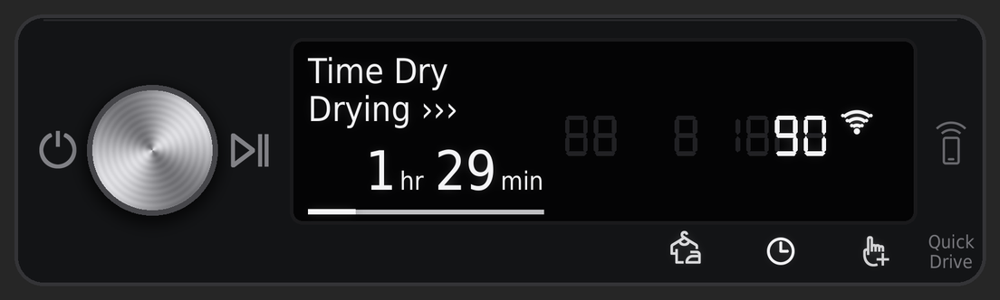

# Samsung AI Washer & Dryer cards for Home Assistant

Picture-elements cards that replicate the control panels of Samsung's AI washer and heat-pump dryer
(the "SimpleUX" panel with the dial, text display and 7-segment digits), driven live by
[LocalThings](https://github.com/mbillow/localthings), which talks to the appliances directly over your
network, or by Home Assistant's own SmartThings integration.

The aim is to show exactly what the real display shows, and nothing it doesn't: Samsung's own
symbols in the same places, the faint unlit segments, and the same behaviour when a cycle is running,
paused or idle.

## What it looks like


### Close-ups

**Washer, mid-spin.** The door lock is lit, and the temperature, rinse count and spin speed stay lit
through the cycle.


**Washer, Bubble Soak.** With Bubble Soak on, the start of the wash phase shows as Bubble Soak, as on
the real display.



**Washer, idle.** The cycle, temperature, rinse count and spin speed are shown, with Smart Control on.


**Dryer, drying.** The dry level (`3`, Normal) is lit over its symbol, and Wrinkle Prevent is on, shown
as 3 (hours).


**Dryer, paused.**


**Dryer, Delay End.** As on the real display, a delayed cycle shows when it will finish instead of
the time left.



**Dryer, Time Dry.** The timed cycles (Time Dry, Warm Air, Cool Air) show the set time over the lit
clock symbol instead of a dry level.



The screenshots are from LocalThings. With SmartThings, the cycle name, dry level and set time stay
dark (see [LocalThings or SmartThings](#localthings-or-smartthings)).

### The Samsung symbols

The symbols are Samsung's own, cut from the control-panel diagrams in the washer and dryer manuals.
They're in [`assets/icons/`](assets/icons/), with the manual and page each one comes from.


## What the cards show

| On the card | Comes from |
|---|---|
| Cycle name (`Towels`, `Time Dry`) | LocalThings only: the cycle select, by course code |
| Stage line (`Washing ›››`, `Bubble Soak ›››`, `Drying ›››`, `Paused`) | progress (LocalThings) or machine state and job state (SmartThings); with the washer's Bubble Soak switch on, 30 minutes of the wash phase show as Bubble Soak, ending 52 minutes before the end |
| Time left and progress bar | LocalThings: the minutes left and percentage the machine reports. SmartThings: the completion time, frozen while paused; after Delay End, the bar starts when the cycle does |
| Finish time during Delay End (`NEXT DAY 5:59 AM`) | the estimated finish (LocalThings) or completion time (SmartThings), to the nearest minute |
| Washer temperature / rinse count / spin speed digits | the wash temperature, rinse cycles and spin speed entities, shown whenever the washer is on, as on the real panel |
| Dryer dry level over its symbol (`1`–`4`: Damp, Less, Normal, More) | LocalThings only: the dry level select, on the sensor cycles (not the timed ones) |
| Dryer set time over the clock symbol (`90`) | LocalThings only: the dry time select, for the timed cycles (Time Dry, Warm Air, Cool Air) |
| Dryer Wrinkle Prevent digit (`3` = 3 hours) | the Wrinkle Prevent switch |
| Wi-Fi, Smart Control and child lock indicators | power, Smart Control (remote control) and child lock entities |
| Washer door lock | lit while a cycle is running (neither source reports the lock itself) |
| Symbols below the display, faint `88 8 1888` segments | shown whenever the machine is on |
| Printed parts of the glass (power, Start/Pause, Smart Control button, Quick Drive) | always shown |

### LocalThings or SmartThings

LocalThings is the recommended source. Both work, and the cards look the same apart from what each
source can tell them.

- **LocalThings** (a custom integration, installed through HACS) talks to each appliance on your
  network, so it keeps working if the internet or Samsung's servers don't. It reports the cycle, the
  dryer's dry level and set time, the minutes left and the progress percentage directly, as well as
  each machine's energy total. These washers and dryers accept LocalThings' automatic certificate.
  Some other appliances (a Samsung fridge, for one) ask for a pre-shared key instead, which is much
  harder to get; see LocalThings' documentation.
- **SmartThings** (built into Home Assistant) goes through Samsung's cloud. Home Assistant's
  integration doesn't make entities of the cycle name, the dryer's dry level or its set time (as of
  Home Assistant 2026.9), so the cards leave those parts of the display dark.

### Known limitations

- **Cycle names** come from LocalThings' course table for these models (`WASHER_CYCLES` /
  `DRYER_CYCLES` in `generator/build.py`). A cycle missing there just shows no name.
- **Dry levels** are mapped Damp 1, Less 2, Normal 3, More 4 (`DRY_LEVELS` in `generator/build.py`).
  Normal = 3 is confirmed against the real panel.
- With SmartThings, **time left and progress** are worked out from the completion time Home Assistant
  receives. The dryer can add a few minutes during a cycle before SmartThings updates the completion
  time, and a Home Assistant restart in the middle of a cycle restarts the progress bar from that
  point.
- **Bubble Soak is timed.** The display shows Washing, then Bubble Soak for the 30 minutes the option
  adds, then Washing again, but neither source reports the soak separately. The card places the
  soak by the time left, ending 52 minutes before the end (`BUBBLE_SOAK_ENDS_LEFT` in
  `generator/build.py`). That matches Cotton with 2 rinses at 1400 rpm; other cycles may differ.
- Temperature and spin values are the ones these machines use (`cold`, 20–90 °C, 400–1400 rpm,
  rinse hold, no spin). If your model reports other values, add them to `WASHER_TEMPS` /
  `WASHER_SPINS` in `generator/build.py` and build your own set (see below).

Built and tested against a Samsung AI washer and a DV9400B-series heat-pump dryer on Home Assistant
2026.9, with LocalThings 0.32 and with SmartThings.

## What's in the repository

| Folder | What it holds |
|---|---|
| [`homeassistant/`](homeassistant/) | The ready-made set, laid out like Home Assistant's `/config` folder: 322 images in `www/samsung-laundry/`, and for SmartThings the template sensors in `packages/` and the two cards in `cards/` |
| [`homeassistant/localthings/`](homeassistant/localthings/) | The template sensors and cards for LocalThings, in the same layout (they use the same images) |
| [`assets/icons/`](assets/icons/) | Samsung's panel symbols, as cut from the manuals |
| [`images/`](images/) | The washer and dryer photos drawn beside each panel |
| [`generator/`](generator/) | `build.py`, which draws every image and writes the YAML; `extract_icons.py`, which re-cuts the symbols from the manuals |
| [`fonts/`](fonts/) | DejaVu Sans Condensed, used for the display text |
| [`docs/`](docs/) | The screenshots in this README |

## Install

You need Home Assistant with LocalThings (recommended) or the SmartThings integration set up, and a
way to copy files into Home Assistant's `/config` folder (for example the Samba share, Studio Code
Server or File editor). You don't need Python unless you want to change the images.

The steps are the same for both sources. For LocalThings, use `homeassistant/localthings/packages/`
and `homeassistant/localthings/cards/`; for SmartThings, use `homeassistant/packages/` and
`homeassistant/cards/`. Install one package, not both: they add the same sensors.

**1. Check your entity names**

The LocalThings cards expect entities starting `samsung_washer_da_wm_tp1_21_common` and
`samsung_dryer_da_wm_tp1_21_common`, the names LocalThings gives these models, such as
`sensor.samsung_washer_da_wm_tp1_21_common_machine_state`. The SmartThings cards expect
`laundry_room_washer` and `laundry_room_dryer`. Look up your washer's and dryer's machine state
entities in Home Assistant. If yours start differently (say `sensor.washer_machine_state`), open the
package and the two card files in a text editor and replace the prefixes with your own.

**2. Copy the images**

Copy the `homeassistant/www/samsung-laundry/` folder to `/config/www/samsung-laundry/`. Home Assistant
serves it at `/local/samsung-laundry/`. If you've just created the `www` folder, restart Home
Assistant once so it picks it up.

**3. Add the template sensors**

Make sure `configuration.yaml` loads packages:

```yaml
homeassistant:
  packages: !include_dir_named packages
```

Copy `samsung_laundry_package.yaml` (from `homeassistant/localthings/packages/` or
`homeassistant/packages/`) to `/config/packages/`, then restart Home Assistant. This adds the sensors
that drive the time, progress bar and the washer's stage line (and, for SmartThings, the cycle start
the progress bar is measured from).

**4. Add the cards**

On your dashboard: **Edit → Add card → Manual**, then paste in the contents of `washer-card.yaml`
(from `homeassistant/localthings/cards/` or `homeassistant/cards/`). Do the same for
`dryer-card.yaml`. The cards are designed for a full-width slot in a sections view.

## Building your own set

Build your own images if you want photos of your own machines, the panel without photos, different
entity prefixes baked in, or values your model reports that these machines don't. You need Python
3.10 or later.

```sh
python3 -m venv .venv && source .venv/bin/activate
pip install -r generator/requirements.txt
python generator/build.py --source localthings     # or --source smartthings
```

Everything lands in `build/`, laid out the same way as `homeassistant/`, so the install steps above
apply unchanged (skip the find-and-replace in step 1). Options:

| Option | What it does |
|---|---|
| `--source` | `smartthings` (the default) or `localthings` |
| `--washer-entities`, `--dryer-entities` | Your entity prefixes. Default to the ready-made set's for the chosen source |
| `--washer-display`, `--dryer-display` | The prefix for the template sensors, if not `samsung_washer_display` / `samsung_dryer_display` |
| `--yaml-only` | Write the cards and package only, not the images |
| `--washer-image`, `--dryer-image` | Your own photos: front-on PNGs with transparent backgrounds, cropped tight to the appliance. Defaults to `images/washer.png` and `images/dryer.png` |
| `--no-photos` | Leave the photos out and show just the panel |
| `--www-path` | Where Home Assistant serves the images from, if not `/local/samsung-laundry` |
| `--out` | Output folder, if not `build/` |

If you change `build.py` and want to update the ready-made set, run
`python generator/build.py --out homeassistant` and
`python generator/build.py --out homeassistant/localthings --source localthings --yaml-only`.

To cut the Samsung symbols again from the manuals, see [`assets/icons/`](assets/icons/).

## How it works

- Each card is a `picture-elements` card. The background is the appliance and the control strip, and
  every lit element is a transparent overlay the size of the strip. The overlays share one position
  box, so they line up at any card width.
- Overlays are rendered at 3× the card's 960 × 400 layout, so they stay sharp on phones.
- Samsung's symbols are stored at 1200 dpi. The build scales each one to size, evens out its line
  weight to match the real display, and lights it with a soft glow.
- Values that change (time, digits, stage) use `state_image` maps. Conditions decide when each part
  of the display is lit.

## Trademarks and credits

Made by Cameron Smith, with Claude (Anthropic).

Samsung, Bespoke and SmartThings are trademarks of Samsung Electronics. This project isn't affiliated
with or endorsed by Samsung. The panel symbols in `assets/icons/` are Samsung's artwork, cut from
Samsung's
[washer](https://downloadcenter.samsung.com/content/UM/202604/20260408143907954/Web_IB_D-PJT_WASHER-MD_SimpleUX_EN_v1.pdf)
and
[dryer](https://downloadcenter.samsung.com/content/UM/202304/20230425115323308/DC68-04400M-00_IB_B-PJT_DV9400B_SimpleUX_EN_pdf.pdf)
user manuals. The appliance photos in `images/` are Samsung product photos.

The cycle names by course code come from [LocalThings](https://github.com/mbillow/localthings)
(MIT licence), which also makes the local data source possible.

Text is set in DejaVu Sans Condensed (`fonts/`, Bitstream Vera licence).

## Licence

Code: MIT, see [LICENSE](LICENSE). The licence doesn't cover Samsung's symbols and photos, or the
images built from them.
