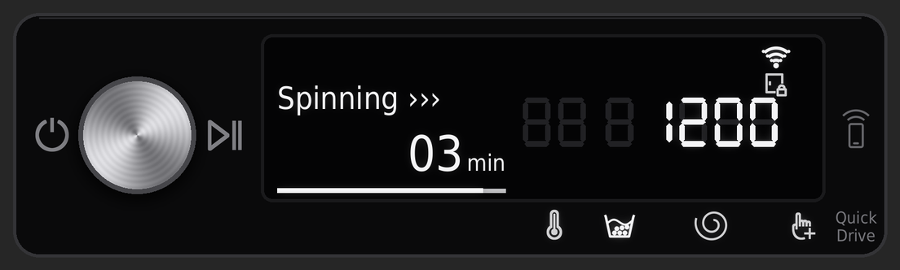
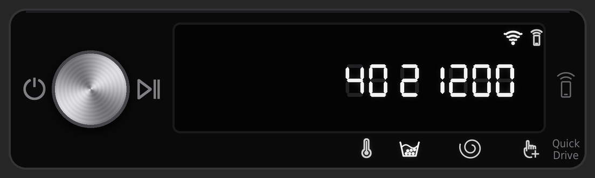
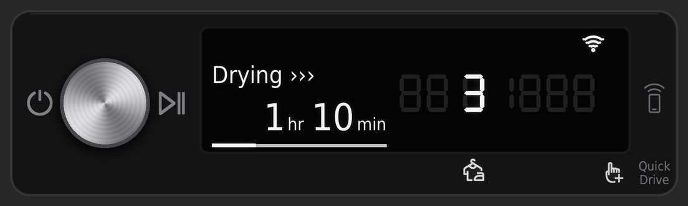
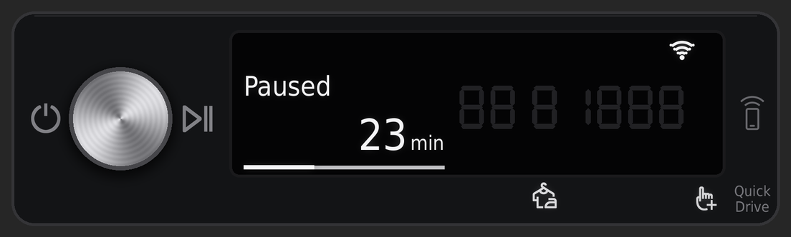

# Samsung AI Washer & Dryer cards for Home Assistant

Picture-elements cards that replicate the control panels of Samsung's AI washer and heat-pump dryer
(the "SimpleUX" panel with the dial, text display and 7-segment digits), driven live by the
Home Assistant SmartThings integration.

The aim is to show exactly what the real display shows, and nothing it doesn't: the same icons in the
same places, the faint unlit segments, and the same behaviour when a cycle is running, paused or idle.

## What it looks like

**Washer, mid-spin.** The door lock is lit and the spin speed shows during the spin phase.



**Washer, idle.** The temperature, rinse count and spin speed are shown, with Smart Control on.



**Dryer, drying.** Wrinkle Prevent is on, shown as 3 (hours).



**Dryer, paused.**



These show the control panel. If you add a photo of your appliance, the card shows it to the left.

## What the cards show

| On the card | Comes from |
|---|---|
| Stage line (`Washing ›››`, `Drying ›››`, `Paused`) | machine state and job state |
| Time left and progress bar | the completion time, frozen while paused |
| Washer temperature / rinse count / spin speed digits | the water temperature, rinse cycles and spin level entities. All three when idle; while running, each one during its own phase, as on the real panel |
| Dryer Wrinkle Prevent digit (`3` = 3 hours) | the Wrinkle Prevent switch |
| Wi-Fi, Smart Control and child lock indicators | power, remote control and child lock entities |
| Washer door lock | lit while a cycle is running (SmartThings doesn't report the lock itself) |
| Button icons below the display, faint `88 8 1888` segments | shown whenever the machine is on |
| Printed parts of the glass (power, Start/Pause, Smart Control button, Quick Drive) | always shown |

### Known limitations

- **No cycle name** (the `Cotton` / `Quick Dry 35'` line) and **no dry level** on the dryer. The
  appliances report both to SmartThings, but the Home Assistant integration doesn't turn them into
  entities (as of Home Assistant 2026.9). The dryer's dry-level icon and digits are built
  (`dryer-level.png`, `dryer-dry-1..4.png`) but not used by the card, so it never shows a dry level
  the real display isn't showing.
- **Time left and progress** are worked out from the completion time Home Assistant receives. The
  dryer can add a few minutes during a cycle before SmartThings updates the completion time.
- A Home Assistant restart in the middle of a cycle restarts the progress bar from that point.
- Temperature and spin values are the ones these machines use (`cold`, 20–90 °C, 400–1400 rpm,
  rinse hold, no spin). If your model reports other values, add them to `WASHER_TEMPS` /
  `WASHER_SPINS` in `generator/build.py`.

Built and tested against a Samsung AI washer and a DV9400B-series heat-pump dryer on Home Assistant 2026.9.

## Setup

You need Python 3.10 or later to build the images, and Home Assistant with the SmartThings
integration set up.

**1. Install the build requirements**

```sh
python3 -m venv .venv && source .venv/bin/activate
pip install -r generator/requirements.txt
```

**2. Download Samsung's manuals**

The panel icons are cut from the vector control-panel diagrams in Samsung's own user manuals, on your
machine, at build time. No Samsung artwork is stored in this repository.

```sh
python generator/build.py --fetch-manuals
```

**3. Find your entity prefixes**

Look up your washer's machine state entity in Home Assistant. If it's
`sensor.laundry_room_washer_machine_state`, your prefix is `laundry_room_washer`. Do the same for the
dryer.

**4. (Optional) add photos of your appliances**

Save front-on photos as `images/washer.png` and `images/dryer.png`, as PNGs with transparent
backgrounds cropped tight to the appliance. They're drawn to the left of the control panel. Without
them, the cards show just the panel.

**5. Build**

```sh
python generator/build.py \
  --washer-entities laundry_room_washer --dryer-entities laundry_room_dryer \
  --washer-image images/washer.png --dryer-image images/dryer.png
```

Everything lands in `build/samsung-laundry/`: about 155 images plus three YAML files.

**6. Copy the images to Home Assistant**

Copy the `.png` files to `/config/www/samsung-laundry/`. Home Assistant serves them at
`/local/samsung-laundry/`. If you've just created the `www` folder, restart Home Assistant once.
Use `--www-path` if you put them somewhere else.

**7. Add the template sensors**

Make sure `configuration.yaml` loads packages:

```yaml
homeassistant:
  packages: !include_dir_named packages
```

Copy `samsung_laundry_package.yaml` to `/config/packages/`, then restart Home Assistant.

**8. Add the cards**

On your dashboard: **Edit → Add card → Manual**, then paste in `washer-card.yaml`. Do the same for
`dryer-card.yaml`. The cards are designed for a full-width slot in a sections view.

`homeassistant/` contains the YAML generated with the default prefixes, if you want to read it before
building.

## How it works

- Each card is a `picture-elements` card. The background is the appliance and the control strip, and
  every lit element is a transparent overlay the size of the strip. The overlays share one position
  box, so they line up at any card width.
- Overlays are rendered at 3× the card's 960 × 400 layout, so they stay sharp on phones.
- Values that change (time, digits, stage) use `state_image` maps. Conditions decide when each part
  of the display is lit.
- The two manuals are pinned by SHA-256, because the icon crop positions are specific to those files.

## Trademarks and credits

Made by Cameron Smith, with Claude (Anthropic).

Samsung, Bespoke and SmartThings are trademarks of Samsung Electronics. This project isn't affiliated
with or endorsed by Samsung. The panel icons are Samsung's artwork. The build extracts them from
Samsung's publicly available manuals on your machine; the icon files themselves aren't stored in
this repository, apart from appearing in the screenshots above.

Text is set in DejaVu Sans Condensed (`fonts/`, Bitstream Vera licence).

## Licence

Code: MIT, see [LICENSE](LICENSE).
