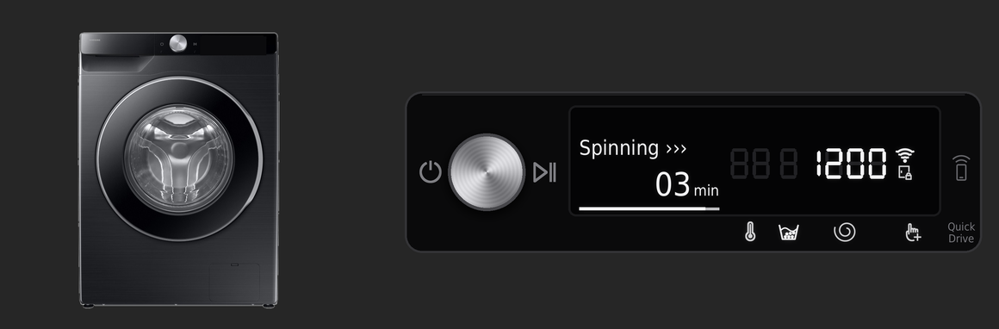
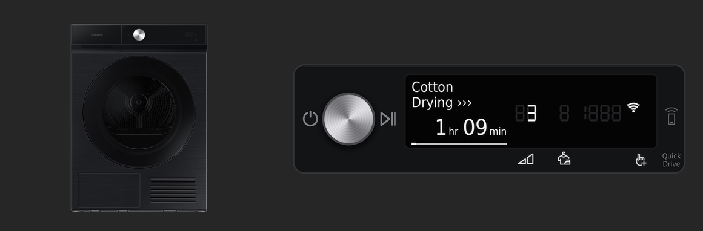
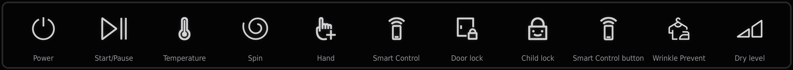

# Samsung AI Washer & Dryer cards for Home Assistant

Picture-elements cards that replicate the control panels of Samsung's AI washer and heat-pump dryer
(the "SimpleUX" panel with the dial, text display and 7-segment digits), driven live by the
Home Assistant SmartThings integration.

The aim is to show exactly what the real display shows, and nothing it doesn't: Samsung's own
symbols in the same places, the faint unlit segments, and the same behaviour when a cycle is running,
paused or idle.

## What it looks like





### Close-ups

**Washer, mid-spin.** The door lock is lit and the spin speed shows during the spin phase.


**Washer, idle.** The temperature, rinse count and spin speed are shown, with Smart Control on.


**Dryer, drying.** Wrinkle Prevent is on, shown as 3 (hours).


**Dryer, paused.**


### The Samsung symbols

The symbols are Samsung's own, cut from the control-panel diagrams in the washer and dryer manuals.
They're in [`assets/icons/`](assets/icons/), with the manual and page each one comes from.



## What the cards show

| On the card | Comes from |
|---|---|
| Stage line (`Washing ›››`, `Drying ›››`, `Paused`) | machine state and job state |
| Time left and progress bar | the completion time, frozen while paused |
| Washer temperature / rinse count / spin speed digits | the water temperature, rinse cycles and spin level entities. All three when idle; while running, each one during its own phase, as on the real panel |
| Dryer Wrinkle Prevent digit (`3` = 3 hours) | the Wrinkle Prevent switch |
| Wi-Fi, Smart Control and child lock indicators | power, remote control and child lock entities |
| Washer door lock | lit while a cycle is running (SmartThings doesn't report the lock itself) |
| Symbols below the display, faint `88 8 1888` segments | shown whenever the machine is on |
| Printed parts of the glass (power, Start/Pause, Smart Control button, Quick Drive) | always shown |

### Known limitations

- **No cycle name** (the `Cotton` / `Quick Dry 35'` line) and **no dry level** on the dryer. The
  appliances report both to SmartThings, but the Home Assistant integration doesn't turn them into
  entities (as of Home Assistant 2026.9). The dryer's dry-level symbol and digits are built
  (`dryer-level.png`, `dryer-dry-1..4.png`) but not used by the card, so it never shows a dry level
  the real display isn't showing.
- **Time left and progress** are worked out from the completion time Home Assistant receives. The
  dryer can add a few minutes during a cycle before SmartThings updates the completion time.
- A Home Assistant restart in the middle of a cycle restarts the progress bar from that point.
- Temperature and spin values are the ones these machines use (`cold`, 20–90 °C, 400–1400 rpm,
  rinse hold, no spin). If your model reports other values, add them to `WASHER_TEMPS` /
  `WASHER_SPINS` in `generator/build.py` and build your own set (see below).

Built and tested against a Samsung AI washer and a DV9400B-series heat-pump dryer on Home Assistant 2026.9.

## What's in the repository

| Folder | What it holds |
|---|---|
| [`homeassistant/`](homeassistant/) | The ready-made set, laid out like Home Assistant's `/config` folder: 156 images in `www/samsung-laundry/`, the template sensors in `packages/`, and the two cards in `cards/` |
| [`assets/icons/`](assets/icons/) | Samsung's panel symbols, as cut from the manuals |
| [`images/`](images/) | The washer and dryer photos drawn beside each panel |
| [`generator/`](generator/) | `build.py`, which draws every image and writes the YAML; `extract_icons.py`, which re-cuts the symbols from the manuals |
| [`fonts/`](fonts/) | DejaVu Sans Condensed, used for the display text |
| [`docs/`](docs/) | The screenshots in this README |

## Install

You need Home Assistant with the SmartThings integration set up, and a way to copy files into
Home Assistant's `/config` folder (for example the Samba share, Studio Code Server or File editor).
You don't need Python unless you want to change the images.

**1. Check your entity names**

The ready-made cards expect entities starting `laundry_room_washer` and `laundry_room_dryer`, such as
`sensor.laundry_room_washer_machine_state`. Look up your washer's and dryer's machine state entities
in Home Assistant. If yours start differently (say `sensor.washer_machine_state`), open
`homeassistant/packages/samsung_laundry_package.yaml` and the two files in `homeassistant/cards/` in a
text editor and replace `laundry_room_washer` and `laundry_room_dryer` with your own prefixes.

**2. Copy the images**

Copy the `homeassistant/www/samsung-laundry/` folder to `/config/www/samsung-laundry/`. Home Assistant
serves it at `/local/samsung-laundry/`. If you've just created the `www` folder, restart Home
Assistant once so it picks it up.

**3. Add the template sensors**

Make sure `configuration.yaml` loads packages:

```yaml
homeassistant:
  packages: !include_dir_named packages
```

Copy `homeassistant/packages/samsung_laundry_package.yaml` to `/config/packages/`, then restart
Home Assistant. This adds the sensors that drive the time, progress bar and cycle start.

**4. Add the cards**

On your dashboard: **Edit → Add card → Manual**, then paste in the contents of
`homeassistant/cards/washer-card.yaml`. Do the same for `dryer-card.yaml`. The cards are designed for
a full-width slot in a sections view.

## Building your own set

Build your own images if you want photos of your own machines, the panel without photos, different
entity prefixes baked in, or values your model reports that these machines don't. You need Python
3.10 or later.

```sh
python3 -m venv .venv && source .venv/bin/activate
pip install -r generator/requirements.txt
python generator/build.py --washer-entities laundry_room_washer --dryer-entities laundry_room_dryer
```

Everything lands in `build/`, laid out the same way as `homeassistant/`, so the install steps above
apply unchanged (skip the find-and-replace in step 1). Options:

| Option | What it does |
|---|---|
| `--washer-entities`, `--dryer-entities` | Your SmartThings entity prefixes |
| `--washer-image`, `--dryer-image` | Your own photos: front-on PNGs with transparent backgrounds, cropped tight to the appliance. Defaults to `images/washer.png` and `images/dryer.png` |
| `--no-photos` | Leave the photos out and show just the panel |
| `--www-path` | Where Home Assistant serves the images from, if not `/local/samsung-laundry` |
| `--out` | Output folder, if not `build/` |

If you change `build.py` and want to update the ready-made set, run
`python generator/build.py --out homeassistant`.

To cut the Samsung symbols again from the manuals, see [`assets/icons/`](assets/icons/).

## How it works

- Each card is a `picture-elements` card. The background is the appliance and the control strip, and
  every lit element is a transparent overlay the size of the strip. The overlays share one position
  box, so they line up at any card width.
- Overlays are rendered at 3× the card's 960 × 400 layout, so they stay sharp on phones.
- Samsung's symbols are stored at 1200 dpi. The build scales each one to size, evens out its line
  weight to match the real display, and lights it with a soft glow.
- Values that change (time, digits, stage) use `state_image` maps. Conditions decide when each part
  of the display is lit.

## Trademarks and credits

Made by Cameron Smith, with Claude (Anthropic).

Samsung, Bespoke and SmartThings are trademarks of Samsung Electronics. This project isn't affiliated
with or endorsed by Samsung. The panel symbols in `assets/icons/` are Samsung's artwork, cut from
Samsung's
[washer](https://downloadcenter.samsung.com/content/UM/202604/20260408143907954/Web_IB_D-PJT_WASHER-MD_SimpleUX_EN_v1.pdf)
and
[dryer](https://downloadcenter.samsung.com/content/UM/202304/20230425115323308/DC68-04400M-00_IB_B-PJT_DV9400B_SimpleUX_EN_pdf.pdf)
user manuals. The appliance photos in `images/` are Samsung product photos.

Text is set in DejaVu Sans Condensed (`fonts/`, Bitstream Vera licence).

## Licence

Code: MIT, see [LICENSE](LICENSE). The licence doesn't cover Samsung's symbols and photos, or the
images built from them.
